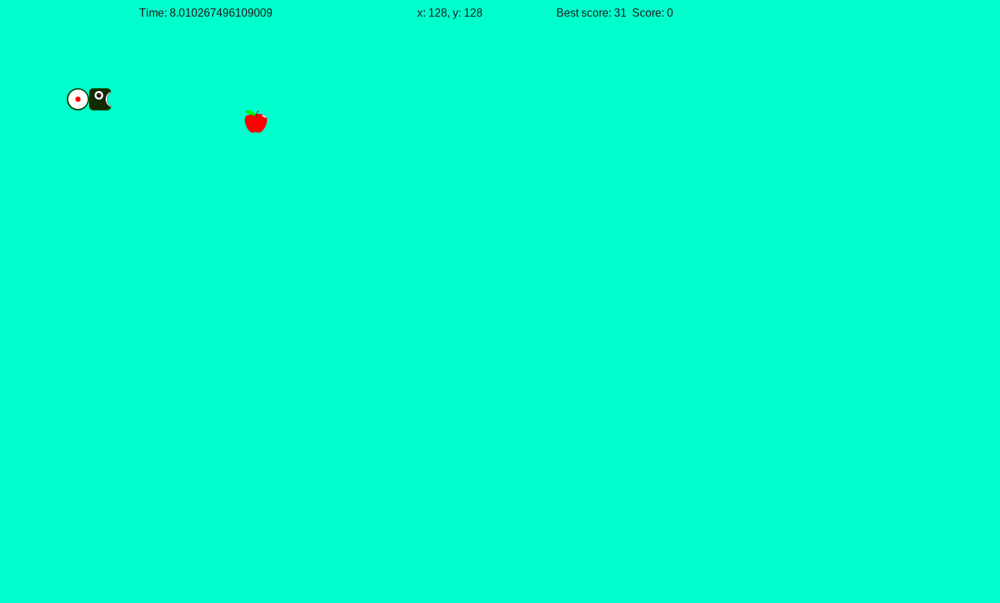

# **Snake**
A simple Snake game app using Python's pygame library.

## Installing

### Requirements

`pip3 install -r requirremants.txt`

Or install just pygame==2.1.2

`pip3 install pygame==2.1.2`

After clone the project, go to SnakeGame repertory and run

`python3 src/main.py`

You can find all constant in settings file

## Screenshots

